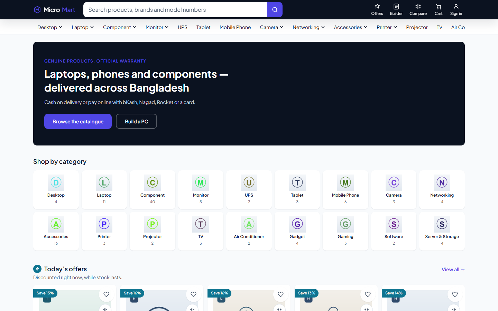
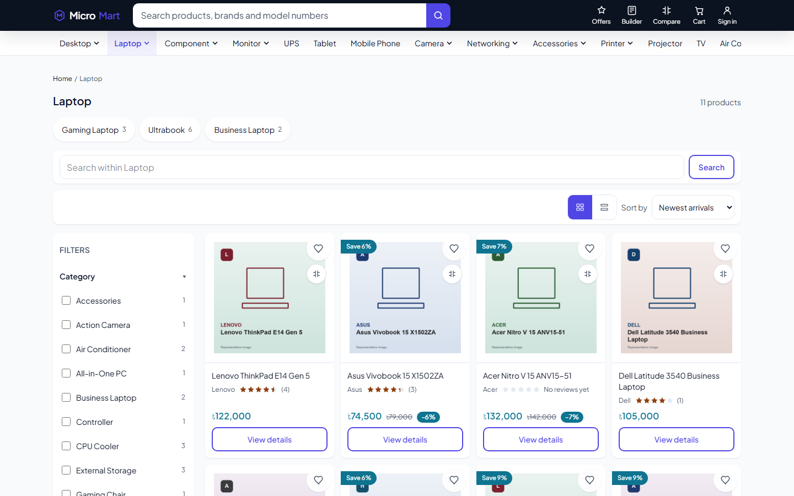
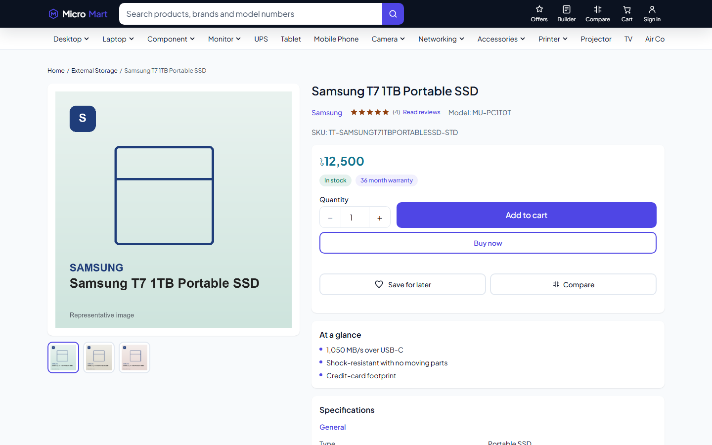
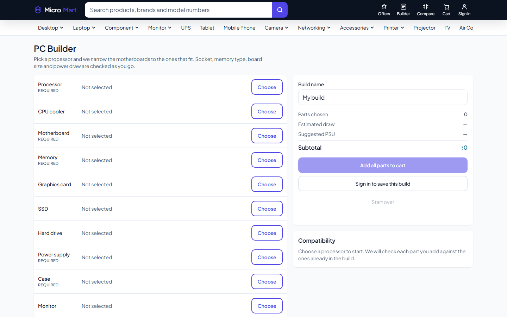
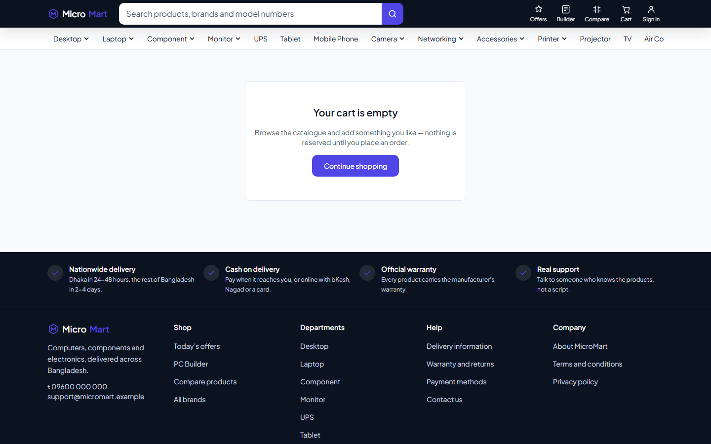
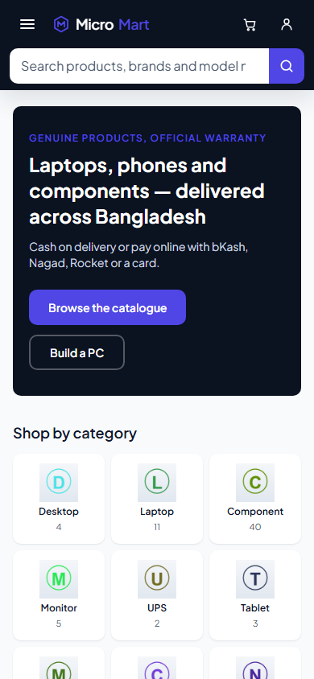
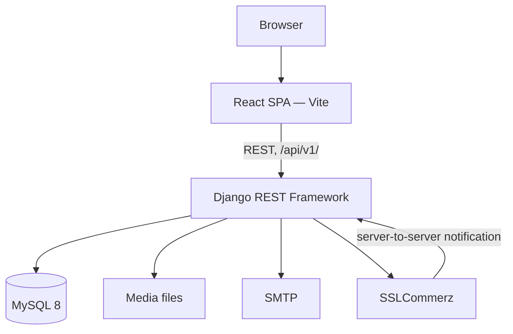

<div align="center">

# MicroMart

**A full-stack e-commerce platform for a single-vendor electronics store in Bangladesh — Django REST Framework, React, MySQL.**

[](https://www.djangoproject.com/)
[](https://www.django-rest-framework.org/)
[](https://react.dev/)
[](https://vite.dev/)
[](https://tailwindcss.com/)
[](https://www.mysql.com/)
[](#testing)

</div>

---

MicroMart is a working online shop: customers browse a catalogue, compare
products, build a PC from compatible parts, and check out as a guest or with an
account. Staff manage the catalogue, stock, orders, coupons and reviews from a
dashboard built into the same React app behind a role gate.

The interesting engineering is not the CRUD. It is the places where getting it
wrong costs money — two customers buying the same last item, a payment that can
be faked from the address bar, or a total that drifts because it was stored as
a float.

<div align="center">

</div>

---

## Contents

- [Features](#features)
- [Screenshots](#screenshots)
- [Architecture](#architecture)
- [The parts worth reading](#the-parts-worth-reading)
- [Getting started](#getting-started)
- [Testing](#testing)
- [Project layout](#project-layout)
- [Documentation](#documentation)
- [Not built yet](#not-built-yet)

---

## Features

**Storefront**

- Catalogue with categories, brands, variants, images and specifications
- Filtering, sorting and faceted counts that update with the filters
- Full-text search with type-ahead suggestions
- Product comparison — a server-computed specification matrix
- **PC Builder** — pick components and get compatibility checked as you go
- Guest cart in the browser, merged into the account cart on sign-in
- Checkout with server-computed shipping, VAT and coupons
- Cash on Delivery, with SSLCommerz hosted checkout wired but not yet connected
- Order history, order tracking, wishlist, saved addresses
- Reviews, restricted to customers who actually received the product

**Admin dashboard**

- Revenue windows, an orders-awaiting-action tile and a revenue chart
- Order fulfilment through a strict status pipeline
- Catalogue CRUD with variants, images and specifications
- Stock adjustment with a mandatory reason and a full audit ledger
- Coupon management, review moderation, store settings
- Two roles: staff can work orders, admins can do everything

---

## Screenshots

<table>
<tr>
<td width="50%"><br><em>Category browse with live facet filters</em></td>
<td width="50%"><br><em>Product detail with specifications and reviews</em></td>
</tr>
<tr>
<td width="50%"><br><em>PC Builder with the compatibility engine</em></td>
<td width="50%"><br><em>Cart, with availability re-checked on every read</em></td>
</tr>
</table>

<div align="center">

<br><em>Mobile-first — usable one-handed at 360px</em>
</div>

---

## Architecture



One React build serves both the storefront and the admin dashboard as separate
route groups. The admin group is code-split, so a shopper never downloads it.

The backend is layered, and the layering is the load-bearing rule:

```
models  →  services  →  serializers  →  views
            ▲
            all business logic lives here
```

Views only translate HTTP. Both the storefront API and the admin API call the
same service functions, so a rule cannot behave one way for a customer and
another way for staff.

---

## The parts worth reading

Three problems shaped most of the design.

### Overselling

One unit left, two customers press "Place order" at the same moment. The naive
version reads stock, sees 1, and writes 0 — but both requests read before
either writes, so both sell it.

Order confirmation therefore runs in one transaction that locks the variant
rows with `SELECT ... FOR UPDATE` before reading them. The second checkout
waits, re-reads stock as 0, and is refused with a message naming the product.

Locks are always taken in primary-key order, because two checkouts holding
overlapping baskets in different orders would deadlock. There is also a
database-level `CHECK (stock >= 0)`, and stock only ever moves on confirmation
— never on add-to-cart.

Tested with real threads against real locks, not mocks.

### Payments

A browser redirect is user-controllable, so it is never proof of payment. The
callback page reads nothing and writes nothing; it does not even look the order
up.

Only the gateway's server-to-server notification can confirm an order, and even
that is not trusted. One field is read from it — a validation id — and used as
a lookup key. Everything that decides the outcome comes from MicroMart's own
outbound call to the gateway's validation API, **including which order it is
about**. Taking the reference from the notification instead would let a forged
body point a genuine ৳500 payment at a ৳200,000 order.

### Money

Every money column is `DECIMAL(12,2)` and crosses the API as a string, never a
JSON number — because JSON numbers are floats, and `0.1 + 0.2` is not `0.3`.
Totals are always computed server-side, and recomputed at placement inside the
lock.

Each of these is written up in [`docs/adr/`](docs/adr/).

---

## Getting started

**Requirements:** Python 3.12, Node 22, MySQL 8.

### 1. Database

```sql
CREATE DATABASE ecom CHARACTER SET utf8mb4 COLLATE utf8mb4_0900_ai_ci;
CREATE USER 'ecom'@'localhost' IDENTIFIED BY 'your-password';
CREATE USER 'ecom'@'127.0.0.1' IDENTIFIED BY 'your-password';
GRANT ALL PRIVILEGES ON ecom.* TO 'ecom'@'localhost', 'ecom'@'127.0.0.1';
GRANT ALL PRIVILEGES ON `test_ecom`.* TO 'ecom'@'localhost', 'ecom'@'127.0.0.1';
FLUSH PRIVILEGES;
```

Both `localhost` and `127.0.0.1` accounts are needed — MySQL treats them as
different users, and which one a connection matches depends on name resolution.
The `test_ecom` grant is what lets the test suite create its own database.

### 2. Backend

```bash
cd backend
python -m venv .venv
.venv/Scripts/python.exe -m pip install -r requirements/dev.txt

cp .env.example .env          # then set DATABASE_URL and DJANGO_SECRET_KEY

.venv/Scripts/python.exe manage.py migrate
.venv/Scripts/python.exe manage.py seed_demo      # logins, shipping zones, coupons
.venv/Scripts/python.exe manage.py seed_catalog   # 117 products with imagery
.venv/Scripts/python.exe manage.py runserver
```

### 3. Frontend

In a second terminal:

```bash
cd frontend
npm install
npm run dev
```

Open **<http://localhost:5173>** — not port 8000. The dev server proxies `/api`
through to Django, which keeps the browser on one origin so the auth cookie
works.

### Demo logins

| Role | Email | Password |
|---|---|---|
| Customer | `shopper@example.com` | `Str0ngPass!2026` |
| Admin | `admin@example.com` | `ChangeMe!2026` |

A guided tour of the features is in
[`docs/RUNNING-THE-PROJECT.md`](docs/RUNNING-THE-PROJECT.md).

---

## Testing

| Layer | Count | Covers |
|---|---|---|
| Backend (pytest) | **1,372** | Services, API contracts, permissions, state machine, concurrency |
| Frontend (Vitest) | **62** | Money formatting, validation schemas, stores, error boundary |
| End-to-end (Playwright) | 13 specs | Real browser: browsing, guest checkout, cart merge, admin flows |
| Accessibility | ~1,030 lines | axe rules, keyboard operation, focus, touch targets |

```bash
# backend, from backend/
.venv/Scripts/python.exe -m pytest -q
.venv/Scripts/python.exe -m pytest -q -m "not slow"   # skip the thread tests

# frontend, from frontend/
npm run test
npm run test:cov
npx playwright test        # needs both servers running
```

CI runs on every push: Django checks, a migration-drift check, API schema
generation, the backend suite, then frontend lint, unit tests and the build.

---

## Project layout

```
backend/
  config/           settings, root URLs, exception handler, pagination
  apps/
    common/         MoneyField, permissions, health checks — shared
    accounts/       custom user, JWT auth, addresses
    catalog/        products, variants, search, facets, stock ledger
    cart/           server-side cart, guest merge
    orders/         checkout, placement, status machine, totals engine
    payments/       SSLCommerz session and notification handling
    promotions/     coupons and redemptions
    reviews/        reviews, moderation, wishlist
    shipping/       zones and rate quoting
    dashboard/      admin metrics and store settings
    builds/         PC builder and the compatibility engine
      services/     ← business logic for each app lives here

frontend/
  src/
    lib/            axios instance, money formatting, SEO helpers
    stores/         Zustand: auth, cart, compare, builder
    components/     shared UI primitives and the error boundary
    features/       one folder per feature area
    admin/          the dashboard route group, code-split
    routes/         router and guards
  e2e/              Playwright specs
```

---

## Documentation

**Why things are built the way they are** — [Architecture Decision Records](docs/adr/):

| # | Decision |
|---|---|
| [001](docs/adr/001-business-logic-in-services.md) | Business logic lives in a services layer |
| [002](docs/adr/002-404-not-403.md) | Someone else's record returns 404, not 403 |
| [003](docs/adr/003-money-as-decimal.md) | Money is DECIMAL, never a float |
| [004](docs/adr/004-jwt-in-httponly-cookie.md) | Refresh token in an HttpOnly cookie |
| [005](docs/adr/005-uniform-login-failure.md) | One login failure message for every cause |
| [006](docs/adr/006-stock-locking.md) | Stock is locked with SELECT FOR UPDATE at checkout |
| [007](docs/adr/007-payment-verified-server-side.md) | A payment counts only when the gateway confirms it |
| [008](docs/adr/008-rate-limiting.md) | Every endpoint is rate limited, and the counters are shared |

**Browsable API** — with the backend running, open
<http://localhost:8000/api/docs/>. All 64 endpoints, generated from the code,
with a "Try it out" button on each. The raw schema is at `/api/schema/`.

**Also in `docs/`** — [running the project](docs/RUNNING-THE-PROJECT.md),
[MySQL setup](docs/MYSQL-SETUP.md), the API contracts, and the
[design system](docs/design-system.md).

---

## Not built yet

Stated plainly, because a README that claims everything is finished is not
worth reading:

- **SSLCommerz is wired but not connected.** The session, notification handling
  and verification are built and tested against a stubbed gateway; live
  merchant credentials are not in place, so Cash on Delivery is the working
  payment path.
- **No Docker setup.** Health endpoints (`/healthz/`, `/readyz/`) are in place
  for one.
- **No background job queue.** Emails send inline, which is fine at this scale
  — `EMAIL_TIMEOUT` is set so a slow mail server cannot hold a worker.
- **The Playwright suite does not run in CI.** It needs a live server and a
  seeded database.
- **No error-tracking service** wired up yet.

---

## Tech stack

| | |
|---|---|
| **Backend** | Django 5.2, Django REST Framework 3.16, SimpleJWT, django-filter, drf-spectacular |
| **Database** | MySQL 8 (InnoDB, utf8mb4) with FULLTEXT search indexes |
| **Frontend** | React 18, Vite 8, Tailwind CSS v4, TanStack Query, Zustand, React Hook Form + Zod, Recharts |
| **Testing** | pytest, pytest-django, Model Bakery, Vitest, Testing Library, Playwright, axe |
| **Tooling** | GitHub Actions, oxlint, WhiteNoise, Gunicorn |
